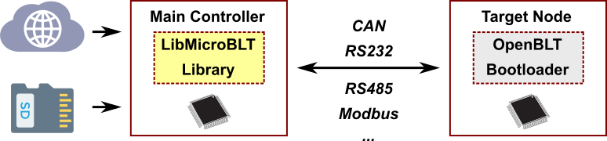

# LibMicroBLT

The LibMicroBLT library encompasses all the functionality needed to perform a firmware update on another microcontroller, running the [OpenBLT bootloader](https://www.feaser.com/openblt/doku.php). In essence, LibMicroBLT is a microcontroller optimized version of [LibOpenBLT](https://www.feaser.com/openblt/doku.php?id=manual:libopenblt). The latter one was designed for PCs and embedded Linux devices.

LibMicroBLT assumes that the main controller features a file system for the storing firmware files. For example on an SD card, USB stick or a flash memory chip. Internally, the library uses the FatFs software component for accessing the file system:

You are free to choose how the firmware files end up on the file system. A few ideas:

* Manually copied from your PC.
* Downloaded from an FTP server or network drive.
* Downloaded from cloud storage (S3 bucket, Dropbox, Google Drive, OneDrive, etc.)

LibMicroBLT is written in the C programming language (C99) with MISRA compliance in mind. Thanks to its permissive MIT license, you are free to integrate and distribute the library in your commercial closed source firmware. 

## Getting Started

To get started with LibMicroBLT, it is recommended to download the latest stable release from the [releases](https://github.com/feaser/libmicroblt/releases) page. Next, read through the getting started documentation in the [user manual](https://feaser.github.io/libmicroblt).

## User manual

The online user manual is located at the following location:

* [https://feaser.github.io/libmicroblt](https://feaser.github.io/libmicroblt)

## Development

Development of LibMicroBLT takes place at GitHub. Feel free to contribute by submitting issues and pull requests.

* [https://github.com/feaser/libmicroblt/](https://github.com/feaser/libmicroblt/)

Make sure to update the submodules after cloning the GIT repository, because LibMicroBLT makes use of a few submodules:

* `git clone https://github.com/feaser/libmicroblt.git`
* `git submodule update --init`

## Contact

Development and maintenance of LibMicroBLT is sponsored by Feaser. Feaser also offers integration/customization services, and professional technical support on a commercial basis:

* [https://www.feaser.com](https://www.feaser.com)

