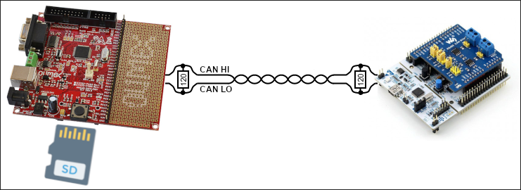

# LibMicroBLT demo application

Integrating a new software component into your own firmware is always easier, if you have a fully functional and preconfigured example to refer to. For this purpose a demo application was added to the LibMicroBLT software package. This section explains how to get the demo application up-and-running. Note that there's no need to actually do this yourself. You can alternatively inspect the source of the demo application, to get a feel for how to use LibMicroBLT in your own firmware.

## System setup

The demo application consists of firmware for the [Olimex STM32-P405](https://www.olimex.com/Products/ARM/ST/STM32-P405/) board. This board acts as the main controller, which has LibMicroBLT integrated. It is capable of performing a firmware update on another microcontroller, that runs the OpenBLT bootloader, connected via a CAN bus. It reads the firmware file in the S-record format, from the FAT32 file system on an attached SD card.

As the target node, so the one that gets its firmware updated, you can use any of the [OpenBLT demo programs](https://www.feaser.com/openblt/doku.php?id=manual:demos), configured to support firmware updates via CAN. The remainder of this section assumes an [ST Nucleo-F091RC](https://www.st.com/en/evaluation-tools/nucleo-f091rc.html) board was selected for the target node. Since this board does not feature a CAN transceiver, a [Waveshare RS485/CAN shield](https://www.waveshare.com/wiki/RS485_CAN_Shield) was attached.

## System preparation

Assuming that you use the same boards, prepare the system as follows:

1. Connect both boards to a CAN bus with proper 120 Ohm line termination resistors.
2. Connect an [ST-Link debugger](https://www.st.com/en/development-tools/st-link-v2.html) interface to the Olimex STM32-P405 board.
3. Power up both boards.
4. Flash the [`openblt_stm32f091.srec`](https://github.com/feaser/openblt/tree/master/Target/Demo/ARMCM0_STM32F0_Nucleo_F091RC_CubeIDE/Boot/Debug) OpenBLT demo bootloader onto the ST Nucleo-F091RC board.
5. Store the [`demoprog_stm32f091.srec`](https://github.com/feaser/openblt/tree/master/Target/Demo/ARMCM0_STM32F0_Nucleo_F091RC_CubeIDE/Prog/Debug) OpenBLT demo user program for the ST Nucleo-F091RC board on the SD card.
6. Insert the SD card into the Olimex STM32-P405 board.

## Build, flash and run the demo application

With the system prepared, you just need to build, flash and run the demo application. The demo application was developed with the [STM32CubeIDE](https://www.st.com/en/development-tools/stm32cubeide.html) development environment. Start STM32CubeIDE, create a new workspace and import the demo application. The demo application is located in:

* `demos/ARMCM4_STM32F4_Olimex_STM32P405_CubeIDE/`

Once imported, build the firmware of the demo application by selecting *Project* &rarr; *Build Project* from the STM32CubeIDE menu. This creates the firmware file:

* `demos/ARMCM4_STM32F4_Olimex_STM32P405_CubeIDE/Debug/Demo.elf`

Start a debugger session to flash this firmware onto the Olimex STM32-P405 board. You can run the demo application using the debugger directly. Alternatively, you can close the debugger session and hit the reset button on the board the run the demo application.

## Perform a firmware update

To start the firmware update, press the big black push-button on the Olimex STM32-P405 board. The demo application then looks for a file in the root directory on the SD card, which starts with `demoprog`  and ends with `.srec`.  In our case, this means it finds the file `demoprog_stm32f091.srec` on the SD-card. Note that this part is done with the help of function `AppLocateFirmwareFile()`. 

After detecting the `demoprog_stm32f091.srec` on the SD card, the demo application starts the firmware update procedure by calling function `UpdateFirmware()`. This function uses the LibMicroBLT API to:

1. Initialize the [Firmware](apiref.md#firmware-module) and [Session](apiref.md#session-module) modules.
2. Open and parse the `demoprog_stm32f091.srec` firmware file on the SD card.
3. Connect to the bootloader on the Nucleo-F091RC board via the CAN bus.
4. Erase the flash memory segments that should be reprogrammed.
5. Read the new firmware data from the firmware file and program it to the flash memory.
6. Disconnect from the bootloader on the Nucleo-F091RC, which also automatically starts the newly programmed firmware.
7. Close the firmware file.
8. Terminate the Firmware and Session modules.

## A closer look

The logic for the actual firmware update procedure is implemented in function `UpdateFirmware()` in source file:

* `demos/ARMCM4_STM32F4_Olimex_STM32P405_CubeIDE/App/update.c`

It was developed such that you can reuse this source file and function `UpdateFirmware()` in your own firmware.

The task that drives the demo application is called `AppTask()` and is located in source file:

* `demos/ARMCM4_STM32F4_Olimex_STM32P405_CubeIDE/App/app.c`

For detecting the firmware file on the SD card, you can take function `AppLocateFirmwareFile()` as a starting point. You just need to modify it such that it looks for the filename or filename pattern that you decided on for your firmware files.

The demo application builds on the [FreeRTOS](https://www.freertos.org/) real-time operating system. However, this is not mandatory for LibMicroBLT. You can use whatever operating system you prefer, even if it's a basic super loop that drives your firmware. Note that the demo application showcases how to leverage [MicroTBX's memory pools](https://feaser.github.io/microtbx/mempools/) for FreeRTOS' heap management. Feel free to reuse it in your own firmware:

* `demos/ARMCM4_STM32F4_Olimex_STM32P405_CubeIDE/App/FreeRTOSHeap.c`

