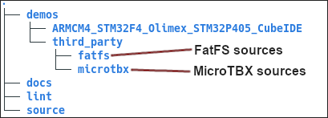
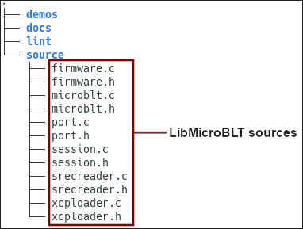
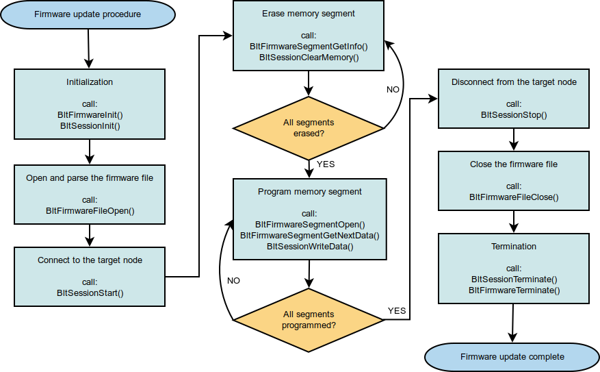

# Getting started with LibMicroBLT

This section explains step-by-step how to get LibMicroBLT integrated and operational in your own firmware.

## Getting the code

The first step is getting the code. Two options exists:

**Download the latest stable release from GitHub:**

* [https://github.com/feaser/libmicroblt/releases](https://github.com/feaser/libmicroblt/releases)

**Clone the development version from GitHub:**

* `git clone https://github.com/feaser/libmicroblt.git`
* `git submodule update --init`

Option 1 is the recommended option. Option 2 is only needed, when you want to participate in the development. For example by submitting a pull request.

## Integrate MicroTBX and FatFS

As shown in the presentation of the [LibMicroBLT architecture](index.md#library-architecture), this library depends on two third-party components:

* Feaser's own [MicroTBX](https://github.com/feaser/microtbx/) - Generic microcontroller software toolbox.
* ELM's [FatFS](http://elm-chan.org/fsw/ff/00index_e.html) - For accessing a FAT32 file system.

Start by integrating these two modules into your firmware. The LibMicroBLT package includes both components, meaning that you can copy the source code from there:



Refer to the MicroTBX and FatFS websites for detailed instructions on how to integrate these components into your firmware. Alternatively, you can refer to the [demo application](demo.md) that's included in the LibMicroBLT package.

## Integrate LibMicroBLT

After integrating the third-party component dependencies, continue with the actual integration of LibMicroBLT's sources. You can find these in the `source` directory:



* Copy all the files from the `source` directory to your firmware's project.
* Configure your project such that the added `.c` files are compiled and linked during a build.
* Add the directory that contains the added `.h` files to your compiler's include path.
* In all `.c` source files, where you plan on using LibMicroBLT related functionality, include the library's API header-file:

```c
#include <microblt.h>
```

## Add port function placeholders

The LibMicroBLT code itself is hardware independent. However, it does need access to some of your microcontroller's peripherals. For example for a time reference and for the communication with the other microcontroller, which runs the OpenBLT bootloader. You can implement these hardware specifics in port functions, which we'll link to LibMicroBLT in the next section. Start by adding empty placeholders for these port functions:

```c
/************************************************************************************//**
** \brief     Obtains the current system time in milliseconds.
** \return    Current system time in milliseconds.
**
****************************************************************************************/
uint32_t AppPortSystemGetTime(void)
{
  /* TODO Obtain the current value of the millisecond timer. */
  return TimerGet();
} /*** end of AppPortSystemGetTime ***/


/************************************************************************************//**
** \brief     Transmits an XCP packet using the transport layer implemented by the port.
**            The transmission itself can be blocking.
** \param     txPacket The XCP packet to transmit using the application's transport layer
**            of choice.
** \return    TBX_OK if the packet could be transmitted, TBX_ERROR otherwise.
**
****************************************************************************************/
uint8_t AppPortXcpTransmitPacket(tPortXcpPacket const * txPacket)
{
  uint8_t result = TBX_ERROR;

  /* Verify parameter. */
  TBX_ASSERT(txPacket != NULL);

  /* Only continue with valid parameter. */
  if (txPacket != NULL)
  {
    /* TODO Transmit the txPacket. */
    result = TBX_OK;
  }

  /* Give the result back to the caller. */
  return result;
} /*** end of AppPortXcpTransmitPacket ***/


/************************************************************************************//**
** \brief     Attempts to receive an XCP packet using the transport layer implemented by
**            the port. The reception should be non-blocking.
** \param     rxPacket Structure where the newly received XCP packet should be stored.
** \return    TBX_TRUE if a packet was received, TBX_FALSE otherwise.
**
****************************************************************************************/
uint8_t AppPortXcpReceivePacket(tPortXcpPacket * rxPacket)
{
  uint8_t result = TBX_FALSE;

  /* Verify parameter. */
  TBX_ASSERT(rxPacket != NULL);

  /* Only continue with valid parameter. */
  if (rxPacket != NULL)
  {
    /* TODO Check if a new XCP packet was received and store it in rxPacket. */
    result = TBX_TRUE;
  }

  /* Give the result back to the caller. */
  return result;
} /*** end of AppPortXcpReceivePacket ****/


/************************************************************************************//**
** \brief     Computes the key for the programming resource.
** \param     seedLen  length of the seed
** \param     seedPtr  pointer to the seed data
** \param     keyLenPtr pointer where to store the key length
** \param     keyPtr pointer where to store the key data
** \return    TBX_OK if the key could be calculated, TBX_ERROR otherwise.
**
****************************************************************************************/
uint8_t AppPortXcpComputeKeyFromSeed(uint8_t seedLen, uint8_t const * seedPtr,
                                            uint8_t * keyLenPtr, uint8_t * keyPtr)
{
  uint8_t result = TBX_FALSE;

  /* Verify parameters. */
  TBX_ASSERT((seedLen > 0U) && (seedPtr != NULL) && (keyLenPtr != NULL) &&
             (keyPtr != NULL));

  /* Only continue with valid parameters. */
  if ((seedLen > 0U) && (seedPtr != NULL) && (keyLenPtr != NULL) && (keyPtr != NULL))
  {
    /* TODO Compute the key, store it in the keyPtr byte array and set its length in
     *      keyLenPtr.
     */
    result = TBX_OK;
  }

  /* Give the result back to the caller. */
  return result;
} /*** end of AppPortXcpComputeKeyFromSeed ***/
```

Add them to whichever source file makes the most sense, based on your preferred source code organization. You can of course rename these functions to match your code's naming convention. 

## Library initialization

When initializing your firmware, make sure to first link your port functions by initializing the [port module](apiref.md#port-module) and mount your FAT32 partition. This should be done before you enter your firmware's infinite program loop, e.g. start your RTOS scheduler, and before you call any of the other LibMicroBLT API functions:

```c
tPort const portInterface =
{
  .SystemGetTime = AppPortSystemGetTime,
  .XcpTransmitPacket = AppPortXcpTransmitPacket,
  .XcpReceivePacket = AppPortXcpReceivePacket,
  .XcpComputeKeyFromSeed = AppPortXcpComputeKeyFromSeed
};

/* Initialize the port module for linking the hardware dependent parts. */
BltPortInit(&portInterface);
/* Mount the file system, using logical disk 0 */
f_mount(&fileSystem, "0:", 0U);
```

## Implement the port functions

The final integration step involves implementing the port functions to work with your microcontroller and preferred communication transport layer for firmware updates. You can find a fully functional version of these port functions in the [demo application](demo.md). It assumes CAN communication between LibMicroBLT and the other microcontroller, which runs the OpenBLT bootloader.

If you selected a different communication transport layer for firmware updates (RS232, Modbus RTU, etc.), you can look at the OpenBLT code base on how the bootloader expects the [XCP packets](https://www.feaser.com/openblt/lib/exe/fetch.php?media=manual:xcp_1_0_specification.zip) to be formatted for your transport layer. 

## Firmware update procedure

Once you made it to this point, LibMicroBLT is fully operational and you can use it to perform firmware updates on the connected microcontroller node(s), running the OpenBLT bootloader. The [demo application](demo.md) contains a reusable function for this. It's called:

```c
uint8_t UpdateFirmware(char const * firmwareFile, uint8_t nodeId)
```

Feel free to copy it to your own firmware. You can find it in:

* `demos/ARMCM4_STM32F4_Olimex_STM32P405_CubeIDE/App/update.c`

The following flowchart further explains the firmware update procedure, using LibMicroBLT:




