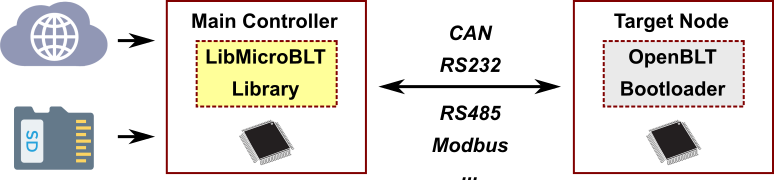

# Introduction to LibMicroBLT

The LibMicroBLT library encompasses all the functionality needed to perform a firmware update on another microcontroller, running the [OpenBLT bootloader](https://www.feaser.com/openblt/doku.php). In essence, LibMicroBLT is a microcontroller optimized version of [LibOpenBLT](https://www.feaser.com/openblt/doku.php?id=manual:libopenblt). The latter one was designed for PCs and embedded Linux devices.

LibMicroBLT assumes that the main controller features a file system for the storing firmware files. For example on an SD card, USB stick or a flash memory chip. Internally, the library uses the [FatFs](http://elm-chan.org/fsw/ff/00index_e.html) software component for accessing the file system:

You are free to choose how the firmware files end up on the file system. A few ideas:

* Manually copied from your PC.
* Downloaded from an FTP server or network drive.
* Downloaded from cloud storage (S3 bucket, Dropbox, Google Drive, OneDrive, etc.)

LibMicroBLT is written in the C programming language (C99) with [MISRA](misra.md) compliance in mind. Thanks to its permissive [MIT license](license.md), you are free to integrate and distribute the library in your commercial closed source firmware. 

The library is hardware independent. With the help of the port module, you can link your own implemented hardware specifics. The included [demo application](demo.md) provides an example of how to implement these port specific functions. This user manual includes an [API reference](apiref.md), explaining in details how to use LibMicroBLT. The [getting started section](getting_started.md) of this user manual contains instructions on how to get LibMicroBLT integrated and up-and-running on your microcontroller.

## Example system

Combining LibMicroBLT with OpenBLT's [Master/Slave Gateway add-on module](https://www.feaser.com/en/addons.php#gateway) opens the path to all sorts of nifty system architectures for performing firmware updates. For example:

The main controller, running LibMicroBLT, could perform firmware updates on all attached nodes. In this system architecture, you would just need to integrate the Master/Slave Gateway add-on module with the OpenBLT bootloaders on *Node A1* and *Node B1*.

## Library architecture

The following image illustrates the modular architecture of LibMicroBLT and how it fits into your firmware:

Firmware typically consist of:

* HAL - Hardware Abstraction Layer. For accessing low-level microcontroller peripherals.
* OS - Operating System. Either the good ol' super loop or a real-time operating system (RTOS).
* APP - Your actual application.

The LibMicroBLT library sits in between your application and the hardware abstraction layer. That way your own application can call its functions for performing a firmware update on another microcontroller, which runs the OpenBLT bootloader. Furthermore, the library requires access to some hardware specifics. For example to access a timer and communication peripheral(s).

LibMicroBLT itself depends on two third-party libraries:

* [FatFS](http://elm-chan.org/fsw/ff/00index_e.html) for file system access to read the actual firmware files.
* [MicroTBX](https://github.com/feaser/microtbx) for assertions, critical sections, heap, memory pools and linked lists.

Inside LibMicroBLT, you'll find three modules:

* [Firmware module](apiref.md#firmware-module) - The firmware module embeds all the functionality for reading firmware data from a firmware file.
* [Session module](apiref.md#session-module) - The session module implements all the functionality for communicating  with the OpenBLT bootloader running the other microcontroller(s).
* [Port module](apiref.md#port-module) - The port module makes it possible to connect your hardware specifics to the hardware independent LibMicroBLT library.

